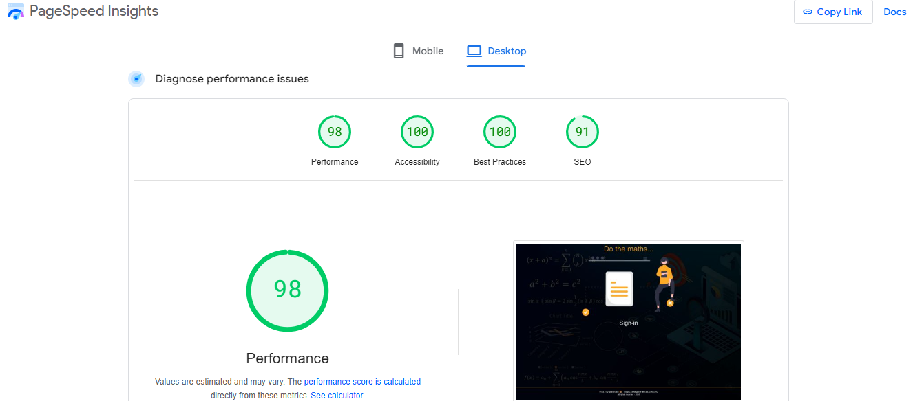

## Web Calculator UI - @Ricardo Ferreira
Web Calculator

Implements a ReactJS based app, using TypeScript, React Router, React Hooks, React Context,AG-GRID Datatable, JWT Decode and a couple of other libraries, to provide a couple of simple math functionalities (addition, subtraction, multiplication, division, square root, and a random string generation) where each functionality will have a separate cost per request.
<br />
Users will have a starting credit/balance. Each request will be deducted from the user’s
balance. If the user’s balance isn’t enough to cover the request cost, the request shall be denied.
<br />
The design is a try to move from the conventional login/password pages and I tried to  enrich the UX with information in real time of the balance available and checking the 
operations done.
<br />
Each operation is persisted into a database and can be retrieved through a AG-GRID based datatable supporting pagination, searching and sorting!
<br />
This app consumes services offered by a REStful API at https://api.ferreiras.dev.br/swagger-ui/index.html and does not make any math, of any sort at the front-end. All maths are done in the backend and their results available at specific endpoints.
<br />
The user must be authenticated and authorized accordingly to have full access to the API services.
<br />

I will let you give it a try using these credentials to taste it: <br />
<b>username:</b> <i>example@example.com</i>, <b>password:</b> <i>example.com</i> <br />
<br />
Click at <a href="https://calculatorweb.ferreiras.dev.br" target="_blank" >CalculatorWeb-UI</a>, load 
these credentials, authenticate and get a credit of 100.00 to do your maths!<br />
Enjoy it....
<br />
Why don't you take a look at this short video....to see how it works...
<br />
<a href="https://flonnect.com/video/21c13021d0d1-4cc2-86b5-0a455011855a" target="_blank">Short Video</a>
<hr />

## _Table of contents_
- [Web Calculator UI - @Ricardo Ferreira](#web-calculator-ui---ricardo-ferreira)
- [_Table of contents_](#table-of-contents)
- [_Overview_](#overview)
- [_Screenshot_](#screenshot)
- [_Links_](#links)
- [_Built with_](#built-with)
- [_How I did it_](#how-i-did-it)
- [_Continued development_](#continued-development)
  - [_Useful resources_](#useful-resources)
- [_Author_](#author)
- [Acknowledgments](#acknowledgments)
## _Overview_
These web pages were coded using ReactJS exploring hooks such as useState, useLocation, useEffect, useContext:
- src|
    - App.tsx
    - assets|
    - components|
      - Footer
      - Header
      - FormInput
      - Operations
      - Welcome
    - routes
      - Home
      - Login
      - Operations
    - services
      - auth-services.ts
      - operation-services.ts
      - operators-service.ts
      - records-service.ts
      - wallet-services.ts
    - utils
      - context-token.ts
      - context-wallet.ts
    - localstorage
      - access-token-repository.ts
      - wallet-repository.ts
   - App.tsx
   - index.css
   - main.tsx
   - index.html
   - tsconfig.json
   - tsconfig.node.json
   - vite.config.js
   - yarn.lock
- public|

## _Screenshot_
[]()
## _Links_
- Live Site URL: [https://calculatorweb.ferreiras.dev.br] 
## _Built with_

[](https://skillicons.dev)


 ## _How I did it_
```jsx
import { createContext } from "react";

export type ContextWalletBalanceType = {

    contextWalletBalance: string;
    setContextWalletBalance: (contextWalletBalance : string) => void;

}

export const ContextWalletBalance = createContext<ContextWalletBalanceType>({

    contextWalletBalance: "0",
    setContextWalletBalance: () => {}
    
})
``` 

## _Continued development_
- Use SMACSS methodology
### _Useful resources_
- [https://reactjs.org] React lets you build user interfaces out of individual pieces called components!.
- [https://yarnpkg.org/] Open-source package manager used to manage dependencies in  JavaScript.
- [https://vitejs.dev/guide/] Build tool that aims to provide a faster and leaner development experience for modern web projects.
## _Author_
- Website - [https://calculatorweb.ferreiras.dev.br] 
## Acknowledgments
- 
